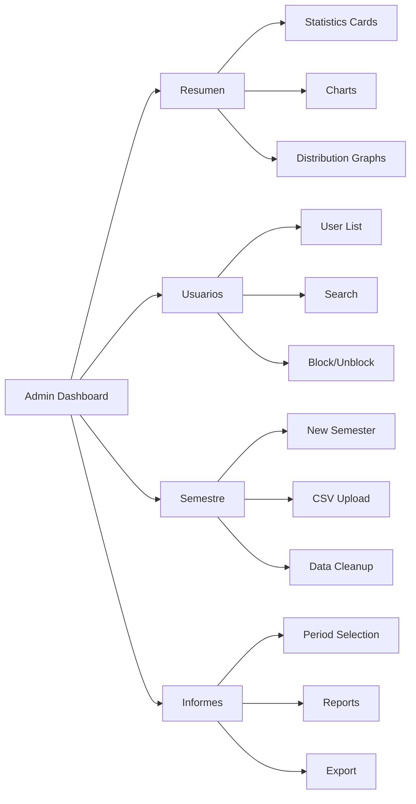

## Overview

The administrative dashboard provides university staff with comprehensive tools to monitor access control, manage users, generate reports, and handle semester transitions. It features real-time statistics, visualizations, and batch operations.

<Info>
Only users with employee status registered in the `administradores` table can access the admin panel.
</Info>

## Dashboard Layout

The admin interface uses a sidebar navigation with four main views:



## Real-Time Metrics

The dashboard displays key metrics updated every 30 seconds:

### Statistics Cards

```jsx ResumenView.jsx
<div className="grid grid-cols-2 xl:grid-cols-4 gap-4">
  <StatCard
    titulo="Total Estudiantes"
    valor={stats?.totalEstudiantes}
    icono={<UsersIcon />}
    colorIcono="text-green-600"
    bgIcono="bg-green-50"
  />
  <StatCard
    titulo="Activos"
    valor={stats?.activos}
    icono={<UserCheckIcon />}
    colorIcono="text-green-600"
    bgIcono="bg-green-50"
  />
  <StatCard
    titulo="Bloqueados"
    valor={stats?.bloqueados}
    icono={<UserMinusIcon />}
    colorIcono="text-red-500"
    bgIcono="bg-red-50"
  />
  <StatCard
    titulo="Reportes TIC hoy"
    valor={stats?.reportesHoy}
    icono={<AlertTriangleIcon />}
    colorIcono="text-yellow-500"
    bgIcono="bg-yellow-50"
  />
</div>
```

### Auto-Refresh Hook

```javascript useAdminDashboard.js
const INTERVALO_REFRESCO = 30_000; // 30 seconds

export const useAdminDashboard = () => {
  const [stats, setStats] = useState(null);
  const [ultimaActualizacion, setUltimaActualizacion] = useState(null);

  // Silent refresh every 30s - doesn't show spinner
  const refrescoSilencioso = useCallback(async () => {
    try {
      const [s, u] = await Promise.all([
        repo.getStats(),
        repo.getUsuarios(),
      ]);
      setStats(s);
      setUsuarios(u);
      setUltimaActualizacion(new Date());
    } catch {
      // Silent - don't show error to avoid interrupting user
    }
  }, []);

  useEffect(() => {
    const intervalo = setInterval(refrescoSilencioso, INTERVALO_REFRESCO);
    return () => clearInterval(intervalo);
  }, [refrescoSilencioso]);

  return { stats, ultimaActualizacion };
};
```

<Card title="Smart Refreshing" icon="rotate">
  The dashboard uses a **silent refresh** pattern:
  - Updates data every 30 seconds in the background
  - Does NOT show loading spinners during refresh
  - Does NOT interrupt user's current view
  - Shows "Last updated" timestamp in header
</Card>

## User Search & Management

The usuarios view provides comprehensive user management:

### User List Features

<CardGroup cols={3}>
  <Card title="Search" icon="magnifying-glass">
    Filter by ID, name, program, or department
  </Card>
  <Card title="Multi-Role Display" icon="user-group">
    Shows all roles per user (Estudiante/Empleado/Contratista)
  </Card>
  <Card title="Quick Actions" icon="bolt">
    Block/unblock users with one click
  </Card>
</CardGroup>

### User Table Component

```jsx EstudiantesView.jsx
import React, { useState } from 'react';

export const EstudiantesView = ({ usuarios, loading, onToggleAcceso }) => {
  const [busqueda, setBusqueda] = useState('');

  const usuariosFiltrados = usuarios.filter(u => {
    const termino = busqueda.toLowerCase();
    return (
      u.nombre_completo.toLowerCase().includes(termino) ||
      u.id_institucional.includes(termino) ||
      u.infoExtra.toLowerCase().includes(termino)
    );
  });

  return (
    <div>
      {/* Search bar */}
      <input
        type="text"
        placeholder="Buscar por nombre, ID, programa..."
        value={busqueda}
        onChange={(e) => setBusqueda(e.target.value)}
      />

      {/* User table */}
      <table>
        <thead>
          <tr>
            <th>Nombre</th>
            <th>ID</th>
            <th>Roles</th>
            <th>Info</th>
            <th>Estado</th>
            <th>Fallas</th>
            <th>Acciones</th>
          </tr>
        </thead>
        <tbody>
          {usuariosFiltrados.map((usuario) => (
            <tr key={usuario.id_institucional}>
              <td>{usuario.nombre_completo}</td>
              <td>{usuario.id_institucional}</td>
              <td>
                <div className="flex gap-1">
                  {usuario.roles.map(rol => (
                    <span key={rol} className="badge">
                      {rol === 'Estudiante' ? '🎓' :
                       rol === 'Empleado' ? '💼' : '🤝'}
                    </span>
                  ))}
                </div>
              </td>
              <td className="text-xs text-gray-500">
                {usuario.infoExtra}
              </td>
              <td>
                <span className={`badge ${
                  usuario.acceso === 'activo'
                    ? 'bg-green-100 text-green-800'
                    : 'bg-red-100 text-red-800'
                }`}>
                  {usuario.acceso === 'activo' ? '✅ Activo' : '🚫 Bloqueado'}
                </span>
              </td>
              <td>
                <span className={`font-semibold ${
                  usuario.total_fallas >= 4 ? 'text-red-600' :
                  usuario.total_fallas >= 3 ? 'text-yellow-600' :
                  'text-gray-600'
                }`}>
                  {usuario.total_fallas}/4
                </span>
              </td>
              <td>
                <button
                  onClick={() => onToggleAcceso(
                    usuario.id_institucional,
                    usuario.acceso === 'activo' ? 'bloqueado' : 'activo'
                  )}
                  className="btn-sm"
                >
                  {usuario.acceso === 'activo' ? 'Bloquear' : 'Desbloquear'}
                </button>
              </td>
            </tr>
          ))}
        </tbody>
      </table>
    </div>
  );
};
```

## Statistics Repository

The admin repository handles all data fetching:

```javascript AdminRepositoryImpl.js
export class AdminRepositoryImpl {
  // Get dashboard statistics
  async getStats() {
    const { data: rolData } = await supabase
      .from('roles')
      .select('id')
      .eq('nombre_rol', 'Estudiante')
      .single();

    const rolEstudianteId = rolData?.id;

    const [
      { count: totalEstudiantes },
      { count: activos },
      { count: bloqueados },
      { count: reportesHoy },
    ] = await Promise.all([
      // Total students
      supabase
        .from('usuario_roles')
        .select('*', { count: 'exact', head: true })
        .eq('rol_id', rolEstudianteId),

      // Active users
      supabase
        .from('usuarios')
        .select('*', { count: 'exact', head: true })
        .eq('acceso', 'activo'),

      // Blocked users
      supabase
        .from('usuarios')
        .select('*', { count: 'exact', head: true })
        .eq('acceso', 'bloqueado'),

      // Today's TIC reports
      supabase
        .from('fallas')
        .select('*', { count: 'exact', head: true })
        .gte('fecha_hora', new Date().setHours(0, 0, 0, 0))
        .lte('fecha_hora', new Date().setHours(23, 59, 59, 999)),
    ]);

    return {
      totalEstudiantes: totalEstudiantes ?? 0,
      activos: activos ?? 0,
      bloqueados: bloqueados ?? 0,
      reportesHoy: reportesHoy ?? 0,
    };
  }
}
```

## Visualizations

The dashboard includes multiple chart types using Recharts:

### Donut Chart - Access Status

```jsx ResumenView.jsx
import { PieChart, Pie, Cell, Tooltip, Legend } from 'recharts';

const donutData = [
  { name: 'Activos', value: stats.activos },
  { name: 'Bloqueados', value: stats.bloqueados },
];

<ResponsiveContainer width="100%" height={200}>
  <PieChart>
    <Pie
      data={donutData}
      cx="50%"
      cy="50%"
      innerRadius={60}
      outerRadius={85}
      paddingAngle={3}
      dataKey="value"
    >
      <Cell fill="#1B6B3A" /> {/* Green for active */}
      <Cell fill="#EF4444" /> {/* Red for blocked */}
    </Pie>
    <Tooltip />
    <Legend />
  </PieChart>
</ResponsiveContainer>
```

### Bar Chart - Failures Last 7 Days

```jsx ResumenView.jsx
import { BarChart, Bar, XAxis, YAxis, CartesianGrid, Tooltip, Legend } from 'recharts';

<ResponsiveContainer width="100%" height={200}>
  <BarChart data={fallas7d}>
    <CartesianGrid strokeDasharray="3 3" vertical={false} />
    <XAxis dataKey="dia" />
    <YAxis allowDecimals={false} />
    <Tooltip />
    <Legend />
    <Bar dataKey="olvido" name="Olvido" fill="#1B6B3A" stackId="a" />
    <Bar dataKey="perdida" name="Pérdida" fill="#EF4444" stackId="a" />
  </BarChart>
</ResponsiveContainer>
```

### Horizontal Bar Chart - Students by Program

```jsx ResumenView.jsx
<ResponsiveContainer width="100%" height={Math.max(80, porPrograma.length * 40)}>
  <BarChart layout="vertical" data={porPrograma}>
    <CartesianGrid strokeDasharray="3 3" horizontal={false} />
    <XAxis type="number" allowDecimals={false} />
    <YAxis type="category" dataKey="programa" width={120} />
    <Tooltip />
    <Bar dataKey="total" name="Estudiantes" fill="#1B6B3A" radius={[0, 3, 3, 0]} />
  </BarChart>
</ResponsiveContainer>
```

## Reports Generation

The informes view allows period-based reporting:

### Period Selection

<CardGroup cols={4}>
  <Card title="Diario" icon="calendar-day">
    Single day report
  </Card>
  <Card title="Semanal" icon="calendar-week">
    Monday-Sunday week
  </Card>
  <Card title="Mensual" icon="calendar">
    Full calendar month
  </Card>
  <Card title="Semestral" icon="calendar-range">
    Active semester period
  </Card>
</CardGroup>

### Report Data Structure

```javascript AdminRepositoryImpl.js
async getReporte(periodo, offset = 0) {
  // Calculate date range based on period and offset
  const { desde, hasta } = calculateDateRange(periodo, offset);

  // Fetch all data in parallel
  const [
    rolesData,
    fallasData,
    programaData,
    dependenciaData,
  ] = await Promise.all([
    supabase.from('usuario_roles').select('roles(nombre_rol)'),
    supabase.from('fallas')
      .select('id_institucional, fecha_hora, motivo')
      .gte('fecha_hora', desde)
      .lte('fecha_hora', hasta),
    supabase.from('info_estudiante').select('id_institucional, programa'),
    supabase.from('info_empleado').select('id_institucional, dependencia'),
  ]);

  // Aggregate data
  return {
    totalEstudiantes: countRole(rolesData, 'Estudiante'),
    totalEmpleados: countRole(rolesData, 'Empleado'),
    totalContratistas: countRole(rolesData, 'Contratista'),
    fallasPeriodo: fallasData.length,
    fallasEstudiantes: countFailuresForRole(fallasData, programaData),
    fallasEmpleados: countFailuresForRole(fallasData, dependenciaData),
    fallasPorDia: aggregateByDay(fallasData),
    porPrograma: aggregateByProgram(programaData),
    porDependencia: aggregateByDepartment(dependenciaData),
    fallasPorPrograma: crossJoinFailures(fallasData, programaData),
    rangoEtiqueta: formatDateRange(desde, hasta),
  };
}
```

## CSV Upload for Semester Management

Admins can upload CSV files to bulk-load data:

### CSV Upload Flow

<Steps>
  <Step title="Upload Files">
    Admin uploads 4 separate CSV files:
    - usuarios.csv (base user data)
    - estudiantes.csv (student info)
    - empleados.csv (employee info)
    - contratistas.csv (contractor info)
  </Step>
  <Step title="Validate Format">
    System validates CSV headers and data types
  </Step>
  <Step title="Show Preview">
    Display first 10 rows for admin to verify
  </Step>
  <Step title="Confirm Upload">
    Admin confirms and system begins upsert
  </Step>
  <Step title="Process Data">
    Repository processes each CSV in correct order
  </Step>
  <Step title="Display Results">
    Show success message with counts inserted
  </Step>
</Steps>

### Repository CSV Functions

```javascript AdminRepositoryImpl.js
// Upload base user data
async cargarUsuarios(registros) {
  const data = registros.map(r => ({
    id_institucional: r.id_institucional,
    documento_identidad: r.documento_identidad,
    nombre_completo: r.nombre_completo,
    acceso: 'activo',
    total_fallas: 0,
  }));
  
  const { error } = await supabase
    .from('usuarios')
    .upsert(data, { onConflict: 'id_institucional' });
    
  if (error) throw new Error(error.message);
  return { insertados: registros.length };
}

// Upload student role data
async cargarEstudiantes(registros) {
  const infoData = registros.map(r => ({
    id_institucional: r.id_institucional,
    programa: r.programa_academico || null,
  }));
  
  await supabase
    .from('info_estudiante')
    .upsert(infoData, { onConflict: 'id_institucional' });
    
  await this.#upsertRol(registros, 'Estudiante');
  return { insertados: registros.length };
}
```

## Admin Page Component

```jsx AdminPage.jsx
import React, { useState } from 'react';
import { AdminSidebar } from '../components/AdminSidebar';
import { ResumenView } from '../components/views/ResumenView';
import { UsuariosView } from '../components/views/EstudiantesView';
import { CargarCSVView } from '../components/views/CargarCSVView';
import { ReportesView } from '../components/views/ReportesView';

export const AdminPage = () => {
  const [vista, setVista] = useState('resumen');
  const { stats, usuarios, loading, toggleAcceso } = useAdminDashboard();

  return (
    <div className="flex min-h-screen bg-gray-50">
      <AdminSidebar vistaActual={vista} onCambiarVista={setVista} />
      
      <main className="flex-1">
        <header>
          <h1>{getTitulo(vista)}</h1>
          <p>{getSubtitulo(vista)}</p>
        </header>
        
        <div className="p-8">
          {vista === 'resumen' && <ResumenView stats={stats} loading={loading} />}
          {vista === 'usuarios' && <UsuariosView usuarios={usuarios} onToggleAcceso={toggleAcceso} />}
          {vista === 'csv' && <CargarCSVView />}
          {vista === 'informes' && <ReportesView />}
        </div>
      </main>
    </div>
  );
};
```

## Access Control

<Warning>
Only employees registered in the `administradores` table can access the admin dashboard. Implement proper authentication checks before allowing access.
</Warning>

```sql administradores.sql
CREATE TABLE administradores (
    id          BIGINT GENERATED ALWAYS AS IDENTITY PRIMARY KEY,
    usuario_id  BIGINT UNIQUE REFERENCES usuarios(id),
    nivel_acceso VARCHAR(20) CHECK (nivel_acceso IN ('director', 'supervisor', 'vigilancia')),
    permisos    JSONB,
    created_at  TIMESTAMPTZ DEFAULT NOW()
);
```

## Performance Optimizations

<CardGroup cols={2}>
  <Card title="Parallel Queries" icon="bolt">
    Uses `Promise.all()` to fetch multiple datasets simultaneously
  </Card>
  <Card title="Indexed Searches" icon="magnifying-glass">
    Database indexes on `id_institucional`, `acceso`, and `fecha_hora`
  </Card>
  <Card title="Silent Refresh" icon="rotate">
    Background updates without interrupting user
  </Card>
  <Card title="Optimistic UI" icon="wand-sparkles">
    Local state updates immediately, syncs with server after
  </Card>
</CardGroup>

## Related Pages

<CardGroup cols={2}>
  <Card title="Blocking System" icon="ban" href="/features/blocking-system">
    Learn how admins unblock users
  </Card>
  <Card title="Failure Tracking" icon="exclamation-triangle" href="/features/failure-tracking">
    Understand the data shown in admin reports
  </Card>
</CardGroup>