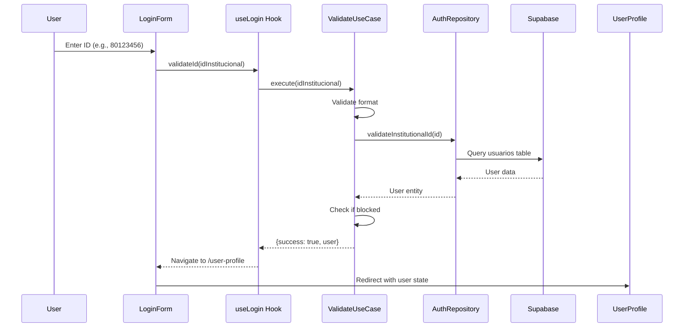

## Overview

The UCC Control de Acceso system uses a simple, ID-based authentication flow designed specifically for users who **do not have their physical ID card**. The system validates institutional IDs against the database and redirects users to their profile page.

<Info>
This authentication system is **only for contingent access** when users don't have their physical card. It does not handle normal entry registration.
</Info>

## How Authentication Works

The authentication process is built on a clean architecture pattern with three layers:

1. **Presentation Layer** - React components that handle user input
2. **Application Layer** - Custom hooks that manage state and business logic
3. **Domain Layer** - Use cases and repository interfaces
4. **Infrastructure Layer** - Actual implementation with Supabase

### Authentication Flow



## Login Component

The login form is a simple, user-friendly interface that accepts only numeric input for the institutional ID.

### Key Features

- **Numeric-only input** - Prevents invalid characters
- **Real-time validation** - Validates as user types
- **Loading states** - Shows spinner during validation
- **Error handling** - Clear error messages for users
- **Responsive design** - Works on all device sizes

### Code Example

```jsx LoginForm.jsx
import React, { useState } from 'react';
import { useLogin } from '../../application/hooks/useLogin';
import { useNavigate } from 'react-router-dom';

export const LoginForm = () => {
  const [idInstitucional, setIdInstitucional] = useState('');
  const { loading, error, validateId, clearError } = useLogin();
  const navigate = useNavigate();

  const handleSubmit = async (e) => {
    e.preventDefault();
    clearError();

    const result = await validateId(idInstitucional);

    if (result.success) {
      // Redirect to user profile page
      navigate('/user-profile', { state: { user: result.user } });
    }
  };

  const handleInputChange = (e) => {
    const value = e.target.value;
    // Only allow numbers
    if (/^\d*$/.test(value)) {
      setIdInstitucional(value);
    }
  };

  return (
    <form onSubmit={handleSubmit}>
      <input
        type="text"
        inputMode="numeric"
        value={idInstitucional}
        onChange={handleInputChange}
        placeholder="Ej: 80123456"
        required
      />
      <button type="submit" disabled={loading || !idInstitucional}>
        {loading ? 'Validando...' : 'INGRESAR'}
      </button>
    </form>
  );
};
```

## Validation Logic

The `ValidateInstitutionalIdUseCase` handles all validation rules:

### Validation Steps

<Steps>
  <Step title="Format Validation">
    Checks if the ID is not empty and contains only numeric characters
  </Step>
  <Step title="Database Lookup">
    Queries the `usuarios` table to find a matching record
  </Step>
  <Step title="Block Status Check">
    Verifies if the user is blocked (acceso = 'bloqueado')
  </Step>
  <Step title="Return Result">
    Returns success with user data or failure with error message
  </Step>
</Steps>

### Use Case Implementation

```javascript ValidateInstitutionalIdUseCase.js
export class ValidateInstitutionalIdUseCase {
  constructor(authRepository) {
    this.authRepository = authRepository;
  }

  async execute(idInstitucional) {
    try {
      // Validate format
      if (!idInstitucional || idInstitucional.trim() === '') {
        return {
          success: false,
          error: 'El ID institucional es requerido'
        };
      }

      // Validate numeric
      if (!/^\d+$/.test(idInstitucional)) {
        return {
          success: false,
          error: 'El ID institucional debe contener solo números'
        };
      }

      // Query database
      const user = await this.authRepository.validateInstitutionalId(idInstitucional);

      if (!user) {
        return {
          success: false,
          error: 'ID institucional no encontrado'
        };
      }

      // Check if blocked
      if (user.isBlocked()) {
        return {
          success: false,
          error: 'Tu acceso está bloqueado. Comunícate con la administración.'
        };
      }

      return {
        success: true,
        user
      };
    } catch (error) {
      return {
        success: false,
        error: error.message || 'Error al validar el ID institucional'
      };
    }
  }
}
```

## Login States

The system handles multiple states throughout the authentication process:

<CardGroup cols={2}>
  <Card title="Idle State" icon="circle">
    Initial state - form is empty and ready for input
  </Card>
  <Card title="Loading State" icon="spinner">
    Validating ID against database - shows spinner
  </Card>
  <Card title="Success State" icon="check">
    User found and active - redirects to profile
  </Card>
  <Card title="Error State" icon="exclamation-triangle">
    Validation failed - shows error message
  </Card>
</CardGroup>

### Error Messages

The system provides specific error messages for different scenarios:

| Scenario | Error Message |
|----------|---------------|
| Empty input | "El ID institucional es requerido" |
| Non-numeric | "El ID institucional debe contener solo números" |
| Not found | "ID institucional no encontrado" |
| Blocked user | "Tu acceso está bloqueado. Comunícate con la administración." |

## useLogin Hook

The custom hook manages the authentication state and exposes methods to the components:

```javascript useLogin.js
import { useState } from 'react';
import { ValidateInstitutionalIdUseCase } from '../../domain/usecases/ValidateInstitutionalIdUseCase';
import { AuthRepositoryImpl } from '../../infrastructure/repositories/AuthRepositoryImpl';

export const useLogin = () => {
  const [loading, setLoading] = useState(false);
  const [error, setError] = useState(null);
  const [user, setUser] = useState(null);

  const authRepository = new AuthRepositoryImpl();
  const validateIdUseCase = new ValidateInstitutionalIdUseCase(authRepository);

  const validateId = async (idInstitucional) => {
    setLoading(true);
    setError(null);

    try {
      const result = await validateIdUseCase.execute(idInstitucional);

      if (result.success) {
        setUser(result.user);
        return { success: true, user: result.user };
      } else {
        setError(result.error);
        return { success: false, error: result.error };
      }
    } catch (err) {
      const errorMessage = 'Error inesperado al validar el ID';
      setError(errorMessage);
      return { success: false, error: errorMessage };
    } finally {
      setLoading(false);
    }
  };

  const clearError = () => setError(null);
  const reset = () => {
    setLoading(false);
    setError(null);
    setUser(null);
  };

  return { loading, error, user, validateId, clearError, reset };
};
```

## Database Schema

The authentication system relies on the `usuarios` table:

```sql usuarios.sql
CREATE TABLE usuarios (
    id                  BIGINT GENERATED ALWAYS AS IDENTITY PRIMARY KEY,
    id_institucional    VARCHAR(20)       NOT NULL UNIQUE,
    documento_identidad VARCHAR(20)       NOT NULL UNIQUE,
    nombre_completo     VARCHAR(150)      NOT NULL,
    acceso              estado_de_acceso  NOT NULL DEFAULT 'activo',
    total_fallas        INT               NOT NULL DEFAULT 0
);

CREATE TYPE estado_de_acceso AS ENUM ('activo', 'bloqueado');
```

### Key Fields

- **id_institucional** - Unique institutional ID (e.g., "80123456")
- **acceso** - Access status: `'activo'` or `'bloqueado'`
- **total_fallas** - Failure counter (0-4)

<Warning>
Users with `acceso = 'bloqueado'` cannot authenticate. They must contact administration to be unblocked.
</Warning>

## Security Considerations

<CardGroup cols={2}>
  <Card title="No Passwords" icon="lock-open">
    System uses ID-only authentication since it's for physical access control
  </Card>
  <Card title="Input Sanitization" icon="shield">
    All input is validated to accept only numeric characters
  </Card>
  <Card title="Database Queries" icon="database">
    Uses parameterized queries via Supabase to prevent SQL injection
  </Card>
  <Card title="Session State" icon="clock">
    User data is passed via React Router state, not stored in localStorage
  </Card>
</CardGroup>

## Related Pages

<CardGroup cols={2}>
  <Card title="User Profiles" icon="user" href="/features/user-profiles">
    Learn about multi-role user profiles after authentication
  </Card>
  <Card title="Blocking System" icon="ban" href="/features/blocking-system">
    Understand how blocked users are handled
  </Card>
</CardGroup>