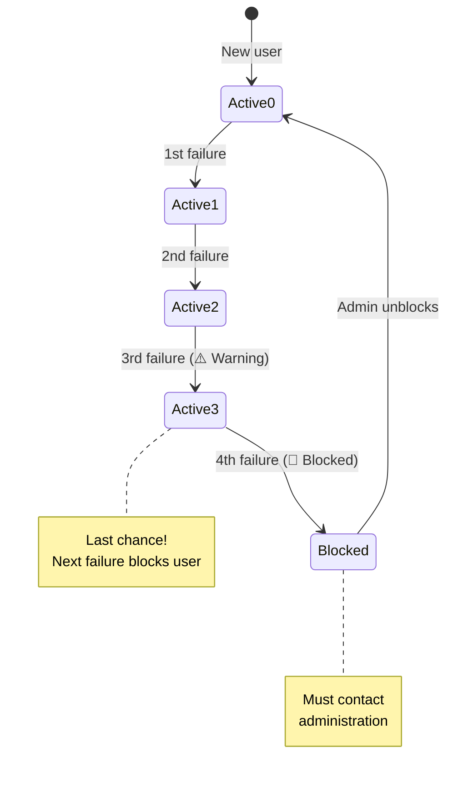

## Overview

The blocking system automatically restricts access for users who accumulate too many failures. When a user reaches **4 failures**, their account is automatically blocked and they cannot log in until an administrator unblocks them.

<Warning>
Blocking is **automatic and immediate** when the 4th failure is registered. No manual intervention is needed to block users.
</Warning>

## Blocking Rules

The system has a simple, consistent rule:

<Card title="4-Failure Rule" icon="calculator">
  **Any combination of failures that totals 4 will trigger automatic blocking.**
  
  Both "olvido" (forgot) and "perdida" (lost) count equally toward the limit.
  
  Examples:
  - 4 x olvido = BLOCKED
  - 3 x olvido + 1 x perdida = BLOCKED
  - 2 x olvido + 2 x perdida = BLOCKED
</Card>

### Progression Example



## Database Implementation

Blocking is enforced at the database level through triggers:

### User Status Field

```sql usuarios.sql
CREATE TYPE estado_de_acceso AS ENUM ('activo', 'bloqueado');

CREATE TABLE usuarios (
    id                  BIGINT GENERATED ALWAYS AS IDENTITY PRIMARY KEY,
    id_institucional    VARCHAR(20) NOT NULL UNIQUE,
    nombre_completo     VARCHAR(150) NOT NULL,
    acceso              estado_de_acceso NOT NULL DEFAULT 'activo',
    total_fallas        INT NOT NULL DEFAULT 0
);
```

### Automatic Blocking Trigger

```sql trigger_fallas.sql
CREATE OR REPLACE FUNCTION fn_actualizar_fallas()
RETURNS TRIGGER
LANGUAGE plpgsql
AS $$
DECLARE
    v_id_inst   VARCHAR(20);
    v_total     INT;
BEGIN
    -- Get affected user ID
    v_id_inst := CASE WHEN TG_OP = 'DELETE' THEN OLD.id_institucional
                                             ELSE NEW.id_institucional END;

    -- Count current failures
    SELECT COUNT(*) INTO v_total
    FROM fallas
    WHERE id_institucional = v_id_inst;

    -- Update counter AND block if >= 4
    UPDATE usuarios
    SET total_fallas = v_total,
        acceso = CASE WHEN v_total >= 4 THEN 'bloqueado' ELSE acceso END
    WHERE id_institucional = v_id_inst;

    RETURN NULL;
END;
$$;

CREATE TRIGGER trg_fallas_insert
    AFTER INSERT ON fallas
    FOR EACH ROW
    EXECUTE FUNCTION fn_actualizar_fallas();
```

<Info>
The trigger runs **after every insert** to the `fallas` table, ensuring blocking is instant and cannot be bypassed.
</Info>

## Blocking States

Users can be in one of two access states:

<CardGroup cols={2}>
  <Card title="activo" icon="check-circle">
    **Active Status**
    
    - Can log in to the system
    - Can register new failures
    - Can access their profile
    - Failures: 0-3
  </Card>
  
  <Card title="bloqueado" icon="ban">
    **Blocked Status**
    
    - Cannot log in
    - Cannot register failures
    - Must contact administration
    - Failures: 4 or more
  </Card>
</CardGroup>

## User Experience When Blocked

### Login Attempt

When a blocked user tries to log in:

```javascript ValidateInstitutionalIdUseCase.js
async execute(idInstitucional) {
  const user = await this.authRepository.validateInstitutionalId(idInstitucional);

  if (!user) {
    return {
      success: false,
      error: 'ID institucional no encontrado'
    };
  }

  // Check if blocked
  if (user.isBlocked()) {
    return {
      success: false,
      error: 'Tu acceso está bloqueado. Comunícate con la administración.'
    };
  }

  return { success: true, user };
}
```

### Blocked User Screen

```jsx
{error === 'Tu acceso está bloqueado...' && (
  <div className="bg-red-50 border-l-4 border-red-500 p-4">
    <div className="flex">
      <span className="text-red-500 text-2xl">🚫</span>
      <div className="ml-3">
        <h3 className="text-red-800 font-bold">Acceso Bloqueado</h3>
        <p className="text-sm text-red-700">
          Has alcanzado el límite de 4 fallas.
        </p>
        <p className="text-sm text-red-700 mt-2">
          Por favor, comunícate con la Dirección para desbloquear tu acceso.
        </p>
      </div>
    </div>
  </div>
)}
```

## Admin Unblocking Process

Administrators can unblock users through the admin dashboard:

### Unblock Function

```javascript AdminRepositoryImpl.js
export class AdminRepositoryImpl {
  /**
   * Toggle user access status (block/unblock)
   * When unblocking, also deletes all failures to reset counter
   */
  async toggleAcceso(id_institucional, nuevoAcceso) {
    // Update access status
    const { error } = await supabase
      .from('usuarios')
      .update({ acceso: nuevoAcceso })
      .eq('id_institucional', id_institucional);
      
    if (error) throw new Error(error.message);

    // When unblocking: delete all failures to reset counter
    // The trigger fn_actualizar_fallas() will recalculate total_fallas = 0
    if (nuevoAcceso === 'activo') {
      const { error: errFallas } = await supabase
        .from('fallas')
        .delete()
        .eq('id_institucional', id_institucional);
        
      if (errFallas) throw new Error(errFallas.message);
    }
  }
}
```

### Unblock Flow

<Steps>
  <Step title="Admin Searches User">
    Admin uses search function to find blocked user in dashboard
  </Step>
  <Step title="View User Details">
    Admin clicks user row to see full failure history
  </Step>
  <Step title="Click Unblock Button">
    Admin clicks toggle to change status from 'bloqueado' to 'activo'
  </Step>
  <Step title="Confirm Action">
    System shows confirmation dialog to prevent accidents
  </Step>
  <Step title="Execute Unblock">
    System updates `acceso` field and deletes all failures
  </Step>
  <Step title="Trigger Recalculates">
    Database trigger sets `total_fallas = 0` automatically
  </Step>
  <Step title="User Can Login">
    User can now log in with a clean slate (0 failures)
  </Step>
</Steps>

## Admin Dashboard View

Admins see blocked users prominently in their dashboard:

### Statistics Card

```jsx ResumenView.jsx
<StatCard
  titulo="Bloqueados"
  valor={stats?.bloqueados}
  icono={<UserMinusIcon />}
  colorIcono="text-red-500"
  bgIcono="bg-red-50"
/>
```

### User List with Status

```jsx EstudiantesView.jsx
{usuarios.map((usuario) => (
  <tr key={usuario.id_institucional}>
    <td>{usuario.nombre_completo}</td>
    <td>{usuario.id_institucional}</td>
    <td>
      <span className={`px-2 py-1 rounded-full text-xs ${
        usuario.acceso === 'activo'
          ? 'bg-green-100 text-green-800'
          : 'bg-red-100 text-red-800'
      }`}>
        {usuario.acceso === 'activo' ? '✅ Activo' : '🚫 Bloqueado'}
      </span>
    </td>
    <td>
      <span className={`font-semibold ${
        usuario.total_fallas >= 4 ? 'text-red-600' :
        usuario.total_fallas >= 3 ? 'text-yellow-600' :
        'text-gray-600'
      }`}>
        {usuario.total_fallas}/4 fallas
      </span>
    </td>
    <td>
      <button
        onClick={() => toggleAcceso(
          usuario.id_institucional,
          usuario.acceso === 'activo' ? 'bloqueado' : 'activo'
        )}
        className={usuario.acceso === 'activo'
          ? 'text-red-600 hover:text-red-800'
          : 'text-green-600 hover:text-green-800'
        }
      >
        {usuario.acceso === 'activo' ? 'Bloquear' : 'Desbloquear'}
      </button>
    </td>
  </tr>
))}
```

## Hook for Admin Actions

```javascript useAdminDashboard.js
export const useAdminDashboard = () => {
  const [usuarios, setUsuarios] = useState([]);
  const [stats, setStats] = useState(null);

  // Toggle user access status
  const toggleAcceso = async (id_institucional, nuevoAcceso) => {
    await repo.toggleAcceso(id_institucional, nuevoAcceso);
    
    // Update local state
    setUsuarios(prev =>
      prev.map(u =>
        u.id_institucional === id_institucional
          ? {
              ...u,
              acceso: nuevoAcceso,
              // Reset failures to 0 when unblocking
              total_fallas: nuevoAcceso === 'activo' ? 0 : u.total_fallas
            }
          : u
      )
    );
    
    // Refresh stats
    repo.getStats().then(s => setStats(s));
  };

  return { usuarios, stats, toggleAcceso };
};
```

## Visual Indicators

The system uses clear visual cues for failure counts:

<CardGroup cols={4}>
  <Card title="0-1 Failures" icon="check">
    <span style={{color: '#22C55E'}}>● Green</span>
    <br />Safe zone
  </Card>
  <Card title="2 Failures" icon="exclamation">
    <span style={{color: '#F59E0B'}}>● Yellow</span>
    <br />Caution
  </Card>
  <Card title="3 Failures" icon="triangle-exclamation">
    <span style={{color: '#F59E0B'}}>● Orange</span>
    <br />Warning: Next failure blocks!
  </Card>
  <Card title="4+ Failures" icon="ban">
    <span style={{color: '#EF4444'}}>● Red</span>
    <br />Blocked
  </Card>
</CardGroup>

## Edge Cases

<AccordionGroup>
  <Accordion title="What if admin unblocks but doesn't delete failures?">
    The system always deletes failures when unblocking to ensure a clean slate. The `toggleAcceso` function explicitly deletes all failure records when setting status to 'activo'.
    
    This prevents situations where a user is unblocked but still shows 4+ failures.
  </Accordion>
  
  <Accordion title="Can a blocked user register more failures?">
    No. The `registrarFalla` function checks the user's status before allowing insertion:
    
    ```javascript
    if (usuario.acceso === 'bloqueado') {
      throw new Error('El usuario está bloqueado...');
    }
    ```
    
    Blocked users cannot use the system at all.
  </Accordion>
  
  <Accordion title="What happens during the 4th failure registration?">
    The flow is:
    1. User submits 4th failure
    2. Row inserted into `fallas` table
    3. Trigger fires immediately
    4. Trigger updates `total_fallas = 4` and `acceso = 'bloqueado'`
    5. Front-end receives success response
    6. User sees blocked message
    7. Next login attempt will be rejected
  </Accordion>
  
  <Accordion title="Can admins manually block users?">
    Yes! Admins can toggle the status to 'bloqueado' even if the user has fewer than 4 failures. This is useful for administrative blocks (e.g., lost card, security issues).
    
    However, the failure count is not modified when manually blocking.
  </Accordion>
</AccordionGroup>

## Security Considerations

<CardGroup cols={2}>
  <Card title="Database-Level Enforcement" icon="database">
    Blocking logic is in database triggers, not application code. Cannot be bypassed.
  </Card>
  <Card title="Immediate Effect" icon="bolt">
    Block status takes effect instantly. No delay or cache issues.
  </Card>
  <Card title="Admin-Only Unblock" icon="user-shield">
    Only authenticated admins can unblock users. Regular users cannot unblock themselves.
  </Card>
  <Card title="Audit Trail" icon="list-check">
    All admin actions should be logged (implement audit table for production).
  </Card>
</CardGroup>

## Real-World Example

<Accordion title="Example: Student Juan's Journey">
  **Day 1:** Juan forgets his card → Registers "olvido" → 1/4 failures → ✅ Access granted
  
  **Day 8:** Juan forgets again → Registers "olvido" → 2/4 failures → ⚠️ Yellow warning shown
  
  **Day 15:** Juan loses his card → Registers "perdida" → 3/4 failures → 🟠 Strong warning: "Next failure blocks you!"
  
  **Day 20:** Juan forgets his temporary card → Registers "olvido" → 4/4 failures → 🚫 **BLOCKED**
  
  Juan can no longer log in. Error message: "Tu acceso está bloqueado..."
  
  **Day 21:** Juan contacts administration → Admin searches "80123456" → Sees 4 failures → Clicks "Desbloquear" → Confirms action
  
  System:
  - Updates `acceso = 'activo'`
  - Deletes all 4 failure records
  - Trigger recalculates `total_fallas = 0`
  
  Juan can now log in with a fresh start (0/4 failures).
</Accordion>

## Related Pages

<CardGroup cols={2}>
  <Card title="Failure Tracking" icon="exclamation-triangle" href="/features/failure-tracking">
    Learn how failures are registered and counted
  </Card>
  <Card title="Admin Dashboard" icon="chart-line" href="/features/admin-dashboard">
    See full admin controls and user management features
  </Card>
</CardGroup>