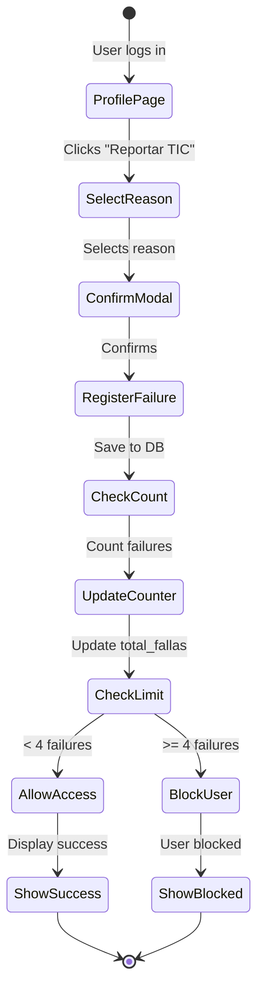

## Overview

The failure tracking system records incidents when users don't have their physical ID card (TIC - Tarjeta de Identificación Cooperativista). Each failure is stored with timestamp, reason, and user information.

<Warning>
Reaching 4 failures triggers an **automatic block**. Users must contact administration to be unblocked.
</Warning>

## Failure Types

The system recognizes two types of failures:

<CardGroup cols={2}>
  <Card title="Olvido (Forgot)" icon="brain">
    User forgot their card at home. Allows up to 3 times before blocking on the 4th.
  </Card>
  <Card title="Perdida (Lost)" icon="question">
    User lost their card. Counts toward the 4-failure limit.
  </Card>
</CardGroup>

<Info>
In the original README, "robo" (theft) was mentioned as causing immediate blocking. The current implementation uses only "olvido" and "perdida", both counting toward the 4-failure limit.
</Info>

## Failure Flow



## Report TIC Modal

Users report failures through a modal interface on their profile page:

### Modal Component

```jsx ReportTICModal.jsx
import React, { useState } from 'react';

const ReportOption = ({ id, selected, onSelect, icon, title, description }) => (
  <button
    type="button"
    onClick={() => onSelect(id)}
    className={`w-full p-4 rounded-xl border-2 ${
      selected ? 'border-red-500 bg-red-50' : 'border-gray-200'
    }`}
  >
    <div className="flex items-start gap-3">
      <span className="text-2xl">{icon}</span>
      <div>
        <p className="font-bold text-sm">{title}</p>
        <p className="text-xs text-gray-500">{description}</p>
      </div>
    </div>
  </button>
);

export const ReportTICModal = ({ isOpen, onClose, onConfirm, nombreUsuario }) => {
  const [selected, setSelected] = useState(null);

  const handleConfirm = () => {
    if (!selected) return;
    onConfirm(selected);
    setSelected(null);
  };

  if (!isOpen) return null;

  return (
    <div className="fixed inset-0 bg-black/50 z-40">
      <div className="bg-white rounded-t-3xl p-6">
        <h3 className="font-bold text-gray-900">Reportar TIC</h3>
        <p className="text-xs text-gray-500">
          {nombreUsuario}, seleccioná el motivo del reporte
        </p>

        <div className="space-y-3 mt-4">
          <ReportOption
            id="perdida"
            selected={selected === 'perdida'}
            onSelect={setSelected}
            icon="⚠️"
            title="Perdí mi TIC"
            description="Mi TIC se extravió. Esto queda registrado como falla."
          />
          <ReportOption
            id="olvido"
            selected={selected === 'olvido'}
            onSelect={setSelected}
            icon="📋"
            title="Olvidé mi TIC"
            description="Olvidé mi TIC hoy. Esto queda registrado como falla."
          />
        </div>

        <div className="flex gap-3 mt-6">
          <button onClick={handleClose}>
            Cancelar
          </button>
          <button onClick={handleConfirm} disabled={!selected}>
            Confirmar
          </button>
        </div>
      </div>
    </div>
  );
};
```

## Database Schema

Failures are stored in the `fallas` table:

```sql fallas.sql
CREATE TABLE fallas (
    id               BIGINT GENERATED ALWAYS AS IDENTITY PRIMARY KEY,
    id_institucional VARCHAR(20) NOT NULL
                     REFERENCES usuarios(id_institucional) ON DELETE CASCADE,
    fecha_hora       TIMESTAMPTZ NOT NULL DEFAULT NOW(),
    motivo           VARCHAR(10) NOT NULL
                     CHECK (motivo IN ('olvido', 'perdida'))
);

CREATE INDEX idx_fallas_id_inst ON fallas (id_institucional);
CREATE INDEX idx_fallas_fecha_hora ON fallas (fecha_hora DESC);
```

### Field Descriptions

| Field | Type | Description |
|-------|------|-------------|
| `id` | BIGINT | Auto-incrementing primary key |
| `id_institucional` | VARCHAR(20) | FK to usuarios table |
| `fecha_hora` | TIMESTAMPTZ | Timestamp with timezone (auto-set) |
| `motivo` | VARCHAR(10) | Reason: 'olvido' or 'perdida' |

## Automatic Counter Update

When a failure is registered, a database trigger automatically updates the user's failure count:

### Trigger Function

```sql trigger_fallas.sql
CREATE OR REPLACE FUNCTION fn_actualizar_fallas()
RETURNS TRIGGER
LANGUAGE plpgsql
AS $$
DECLARE
    v_id_inst   VARCHAR(20);
    v_total     INT;
BEGIN
    -- Get the affected user's ID
    v_id_inst := CASE WHEN TG_OP = 'DELETE' THEN OLD.id_institucional
                                             ELSE NEW.id_institucional END;

    -- Count current failures
    SELECT COUNT(*) INTO v_total
    FROM fallas
    WHERE id_institucional = v_id_inst;

    -- Update counter and block if >= 4
    UPDATE usuarios
    SET total_fallas = v_total,
        acceso = CASE WHEN v_total >= 4 THEN 'bloqueado' ELSE acceso END
    WHERE id_institucional = v_id_inst;

    RETURN NULL;
END;
$$;

-- Trigger after INSERT
CREATE TRIGGER trg_fallas_insert
    AFTER INSERT ON fallas
    FOR EACH ROW
    EXECUTE FUNCTION fn_actualizar_fallas();

-- Trigger after DELETE (for corrections)
CREATE TRIGGER trg_fallas_delete
    AFTER DELETE ON fallas
    FOR EACH ROW
    EXECUTE FUNCTION fn_actualizar_fallas();
```

### How It Works

<Steps>
  <Step title="Insert Failure">
    A new row is inserted into the `fallas` table
  </Step>
  <Step title="Trigger Fires">
    The `trg_fallas_insert` trigger executes after the insert
  </Step>
  <Step title="Count Failures">
    The function counts all failures for that user
  </Step>
  <Step title="Update Counter">
    Updates `total_fallas` in the `usuarios` table
  </Step>
  <Step title="Check Limit">
    If `total_fallas >= 4`, sets `acceso = 'bloqueado'`
  </Step>
</Steps>

## Registration Process

The repository handles failure registration with validation:

```javascript UserProfileRepositoryImpl.js
export class UserProfileRepositoryImpl {
  async registrarFalla(idInstitucional, motivo) {
    // Verify user is not already blocked
    const { data: usuario, error: errUser } = await supabase
      .from('usuarios')
      .select('acceso, total_fallas')
      .eq('id_institucional', idInstitucional)
      .single();

    if (errUser) throw new Error(errUser.message);
    
    if (usuario.acceso === 'bloqueado') {
      throw new Error('El usuario está bloqueado y no puede registrar más fallas.');
    }
    
    if (usuario.total_fallas >= 4) {
      throw new Error('El usuario ya alcanzó el límite de 4 fallas.');
    }

    // Insert the failure
    const { error } = await supabase
      .from('fallas')
      .insert({ id_institucional: idInstitucional, motivo });

    if (error) throw new Error(error.message);
  }
}
```

### Validation Rules

<AccordionGroup>
  <Accordion title="Pre-Insert Validations">
    Before inserting a failure, the system checks:
    
    - User exists in the database
    - User is not already blocked (`acceso != 'bloqueado'`)
    - User has not reached 4 failures yet
    
    If any check fails, the operation is rejected with an error message.
  </Accordion>
  
  <Accordion title="Post-Insert Actions">
    After successfully inserting a failure:
    
    1. Database trigger recalculates `total_fallas`
    2. If count reaches 4, user is automatically blocked
    3. Front-end refreshes profile data to show updated count
    4. Success message is displayed to user
  </Accordion>
</AccordionGroup>

## Failure History Display

Users can view their failure history on their profile:

```jsx FallasHistory.jsx
import React from 'react';

export const FallasHistory = ({ fallas, totalFallas }) => {
  if (fallas.length === 0) return null;

  const getMotivoLabel = (motivo) => {
    const labels = {
      olvido: { icon: '📋', text: 'Olvido', color: 'text-blue-600' },
      perdida: { icon: '⚠️', text: 'Pérdida', color: 'text-red-600' },
    };
    return labels[motivo] || labels.olvido;
  };

  return (
    <div className="bg-white rounded-2xl shadow-sm border p-4">
      <h3 className="font-bold text-gray-800 mb-3">
        Historial de Fallas ({totalFallas}/4)
      </h3>
      
      {fallas.map((falla) => {
        const motivoInfo = getMotivoLabel(falla.motivo);
        const fecha = new Date(falla.fecha_hora);
        
        return (
          <div key={falla.id} className="flex items-center gap-3 py-2 border-b last:border-0">
            <span className="text-2xl">{motivoInfo.icon}</span>
            <div className="flex-1">
              <p className={`text-sm font-semibold ${motivoInfo.color}`}>
                {motivoInfo.text}
              </p>
              <p className="text-xs text-gray-500">
                {fecha.toLocaleDateString('es-CO', {
                  day: 'numeric',
                  month: 'short',
                  year: 'numeric',
                  hour: '2-digit',
                  minute: '2-digit'
                })}
              </p>
            </div>
          </div>
        );
      })}
    </div>
  );
};
```

## Counter Display

The failure counter is prominently displayed with visual warnings:

<CardGroup cols={3}>
  <Card title="Safe (0-1)" icon="check-circle">
    <span style={{color: '#22C55E'}}>Green indicator</span>
    <br />Normal status, no warnings
  </Card>
  <Card title="Warning (2-3)" icon="exclamation-triangle">
    <span style={{color: '#F59E0B'}}>Yellow indicator</span>
    <br />Approaching limit, show caution message
  </Card>
  <Card title="Blocked (4)" icon="ban">
    <span style={{color: '#EF4444'}}>Red indicator</span>
    <br />Access blocked, contact administration
  </Card>
</CardGroup>

## Example Data Flow

<CodeGroup>
```json Request - Register Failure
{
  "id_institucional": "80123456",
  "motivo": "olvido"
}
```

```json Response - Success
{
  "success": true,
  "message": "Falla registrada correctamente"
}
```

```json Database - After Insert
// fallas table - new row
{
  "id": 42,
  "id_institucional": "80123456",
  "fecha_hora": "2026-03-13T10:30:00-05:00",
  "motivo": "olvido"
}

// usuarios table - updated
{
  "id_institucional": "80123456",
  "nombre_completo": "Juan Pérez",
  "acceso": "activo",
  "total_fallas": 2  // incremented by trigger
}
```

```json Response - Blocked User (4th failure)
{
  "success": true,
  "message": "Has alcanzado el límite de 4 fallas. Tu acceso ha sido bloqueado.",
  "blocked": true
}
```
</CodeGroup>

## Admin View of Failures

Administrators can see all user failures in the dashboard:

```javascript AdminRepositoryImpl.js
// Get failures for last 7 days
async getFallasUltimos7Dias() {
  const hace7dias = new Date();
  hace7dias.setDate(hace7dias.getDate() - 6);
  hace7dias.setHours(0, 0, 0, 0);

  const { data, error } = await supabase
    .from('fallas')
    .select('fecha_hora, motivo')
    .gte('fecha_hora', hace7dias.toISOString())
    .order('fecha_hora', { ascending: true });

  if (error || !data) return [];

  // Group by day and motivo
  const diasMap = {};
  // ... aggregation logic
  
  return aggregatedData;
}
```

## Best Practices

<CardGroup cols={2}>
  <Card title="Clear Communication" icon="comments">
    Always explain to users what happens when they report a failure
  </Card>
  <Card title="Visual Feedback" icon="eye">
    Show real-time counter updates after registration
  </Card>
  <Card title="Prevent Double-Submit" icon="hand">
    Disable submit button during API call to prevent duplicates
  </Card>
  <Card title="Error Handling" icon="shield-check">
    Validate user status before allowing failure registration
  </Card>
</CardGroup>

## Related Pages

<CardGroup cols={2}>
  <Card title="Blocking System" icon="ban" href="/features/blocking-system">
    Learn about automatic blocking when reaching 4 failures
  </Card>
  <Card title="Admin Dashboard" icon="chart-line" href="/features/admin-dashboard">
    See how admins monitor and manage failures
  </Card>
</CardGroup>