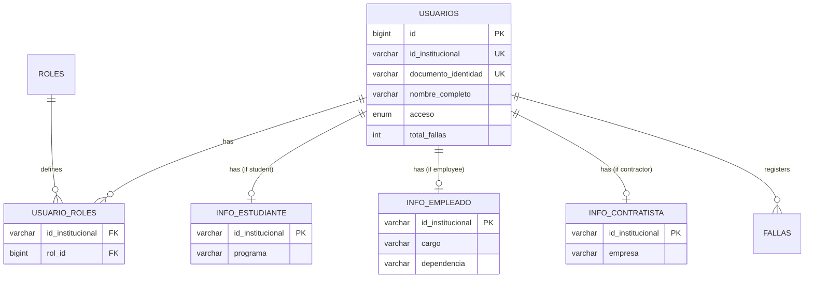

## Overview

The UCC Control de Acceso system supports **multi-role users** - a single person can have multiple roles simultaneously (Student, Employee, and/or Contractor). Each role has its own specific information stored in separate tables.

<Info>
This multi-role architecture allows university staff who are also students to have both roles active at the same time.
</Info>

## Role Types

The system supports three distinct roles:

<CardGroup cols={3}>
  <Card title="Estudiante" icon="graduation-cap">
    Student role with academic program information
  </Card>
  <Card title="Empleado" icon="briefcase">
    Employee role with department and position details
  </Card>
  <Card title="Contratista" icon="handshake">
    Contractor role with company information
  </Card>
</CardGroup>

## User Profile Architecture

The profile system uses a hub-and-spoke database design:



## Profile Page Component

The `UserProfilePage` displays all user information including multiple roles:

### Key Features

- **Dynamic role loading** - Fetches roles from Supabase
- **Role-specific cards** - Shows relevant info for each role
- **Failure history** - Displays past incidents
- **Report TIC button** - Allows users to register a failure

### Component Structure

```jsx UserProfilePage.jsx
import React, { useState } from 'react';
import { useNavigate, useLocation } from 'react-router-dom';
import { useUserProfile } from '../../application/hooks/useUserProfile';
import { ProfileHeader } from '../components/ProfileHeader';
import { PersonalInfoCard } from '../components/PersonalInfoCard';
import { RoleInfoCard } from '../components/RoleInfoCard';
import { FallasHistory } from '../components/FallasHistory';
import { ReportTICModal } from '../components/ReportTICModal';

export const UserProfilePage = () => {
  const navigate = useNavigate();
  const location = useLocation();
  const [modalOpen, setModalOpen] = useState(false);
  const [reportResult, setReportResult] = useState(null);

  // User data from login
  const userFromLogin = location.state?.user;

  // Fetch roles and role-specific info from Supabase
  const { profileData, loading, reportarFalla } = useUserProfile(
    userFromLogin?.idInstitucional
  );

  const totalFallasReal = profileData?.fallas?.length ?? 0;

  const user = {
    idInstitucional: userFromLogin?.idInstitucional,
    nombre_completo: userFromLogin?.nombreCompleto,
    acceso: userFromLogin?.acceso,
    total_fallas: totalFallasReal,
    roles: profileData?.roles ?? [],
    info_estudiante: profileData?.infoEstudiante ?? null,
    info_empleado: profileData?.infoEmpleado ?? null,
    info_contratista: profileData?.infoContratista ?? null,
  };

  const handleConfirmReport = async (motivo) => {
    setModalOpen(false);
    try {
      await reportarFalla(motivo);
      setReportResult(motivo);
    } catch {
      setReportResult('error');
    }
  };

  return (
    <div className="min-h-screen bg-gray-100">
      <ProfileHeader user={user} />
      
      <div className="px-4 py-5 space-y-4">
        {/* Personal Information */}
        <PersonalInfoCard user={user} />

        {/* Role-specific cards */}
        {user.roles.map((rol) => {
          const infoMap = {
            Estudiante: user.info_estudiante,
            Empleado: user.info_empleado,
            Contratista: user.info_contratista,
          };
          return <RoleInfoCard key={rol} rol={rol} info={infoMap[rol]} />;
        })}

        {/* Failure history */}
        <FallasHistory
          fallas={profileData?.fallas ?? []}
          totalFallas={totalFallasReal}
        />

        {/* Report TIC button */}
        <button onClick={() => setModalOpen(true)}>
          ✅ Reportar TIC
        </button>
      </div>

      <ReportTICModal
        isOpen={modalOpen}
        onClose={() => setModalOpen(false)}
        onConfirm={handleConfirmReport}
        nombreUsuario={user.nombre_completo}
      />
    </div>
  );
};
```

## Multi-Role Assignments

Users can have multiple roles simultaneously through the `usuario_roles` junction table:

### Example Multi-Role User

```json
{
  "id_institucional": "80123456",
  "nombre_completo": "Juan Pérez Gómez",
  "roles": ["Estudiante", "Empleado"],
  "info_estudiante": {
    "programa": "Ingeniería de Sistemas"
  },
  "info_empleado": {
    "cargo": "Coordinador de Tesorería",
    "dependencia": "Área Financiera"
  }
}
```

### Database Schema

```sql roles.sql
CREATE TABLE roles (
    id          BIGINT GENERATED ALWAYS AS IDENTITY PRIMARY KEY,
    nombre_rol  VARCHAR(50) NOT NULL UNIQUE,
    descripcion TEXT
);

INSERT INTO roles (nombre_rol, descripcion) VALUES
    ('Estudiante', 'Usuario con matrícula académica activa'),
    ('Empleado', 'Personal administrativo o docente'),
    ('Contratista', 'Personal externo con contrato vigente');

CREATE TABLE usuario_roles (
    id_institucional VARCHAR(20) REFERENCES usuarios(id_institucional) ON DELETE CASCADE,
    rol_id          BIGINT      REFERENCES roles(id) ON DELETE CASCADE,
    PRIMARY KEY (id_institucional, rol_id)
);
```

## Role Information Cards

Each role has a dedicated component that displays role-specific information:

### RoleInfoCard Component

```jsx RoleInfoCard.jsx
import React from 'react';

const rolConfig = {
  Estudiante: {
    icon: '📚',
    label: 'Información Académica',
    color: 'text-green-700',
    fields: (info) => [
      { icon: '🎓', label: 'Programa', value: info.programa },
    ],
  },
  Empleado: {
    icon: '💼',
    label: 'Información Laboral',
    color: 'text-blue-700',
    fields: (info) => [
      { icon: '🏢', label: 'Dependencia', value: info.dependencia },
      { icon: '👔', label: 'Cargo', value: info.cargo },
    ],
  },
  Contratista: {
    icon: '🤝',
    label: 'Información de Contrato',
    color: 'text-orange-700',
    fields: (info) => [
      { icon: '🏭', label: 'Empresa', value: info.empresa },
    ],
  },
};

export const RoleInfoCard = ({ rol, info }) => {
  const config = rolConfig[rol];
  if (!config || !info) return null;

  return (
    <div className="bg-white rounded-2xl shadow-sm border">
      {/* Header */}
      <div className="flex items-center gap-2 px-4 py-3 bg-gray-50">
        <span>{config.icon}</span>
        <h2 className={`text-sm font-bold ${config.color}`}>
          {config.label}
        </h2>
      </div>

      {/* Fields */}
      <div className="px-4">
        {config.fields(info).map((field) => (
          <div key={field.label} className="py-3 border-b last:border-0">
            <span>{field.icon}</span>
            <p className="text-xs text-blue-700">{field.label}</p>
            <p className="text-sm font-semibold">{field.value}</p>
          </div>
        ))}
      </div>
    </div>
  );
};
```

## Role-Specific Information Tables

### Student Information

```sql info_estudiante.sql
CREATE TABLE info_estudiante (
    id_institucional VARCHAR(20) PRIMARY KEY
                     REFERENCES usuarios(id_institucional) ON DELETE CASCADE,
    programa        VARCHAR(200) NOT NULL
);
```

**Fields:**
- `programa` - Academic program (e.g., "Ingeniería de Sistemas", "Derecho")

### Employee Information

```sql info_empleado.sql
CREATE TABLE info_empleado (
    id_institucional VARCHAR(20) PRIMARY KEY
                     REFERENCES usuarios(id_institucional) ON DELETE CASCADE,
    cargo           VARCHAR(100),
    dependencia     VARCHAR(100)
);
```

**Fields:**
- `cargo` - Job position (e.g., "Coordinador", "Asistente")
- `dependencia` - Department (e.g., "Tesorería", "Admisiones")

### Contractor Information

```sql info_contratista.sql
CREATE TABLE info_contratista (
    id_institucional VARCHAR(20) PRIMARY KEY
                     REFERENCES usuarios(id_institucional) ON DELETE CASCADE,
    empresa         VARCHAR(200)
);
```

**Fields:**
- `empresa` - Contracting company name

## useUserProfile Hook

The hook manages profile data fetching and state:

```javascript useUserProfile.js
import { useState, useEffect, useCallback } from 'react';
import { UserProfileRepositoryImpl } from '../../infrastructure/repositories/UserProfileRepositoryImpl';

const repository = new UserProfileRepositoryImpl();

export const useUserProfile = (idInstitucional) => {
  const [profileData, setProfileData] = useState(null);
  const [loading, setLoading] = useState(true);
  const [error, setError] = useState(null);
  const [refreshKey, setRefreshKey] = useState(0);

  useEffect(() => {
    if (!idInstitucional) {
      setLoading(false);
      return;
    }

    const fetchProfile = async () => {
      setLoading(true);
      setError(null);
      try {
        const data = await repository.getProfileData(idInstitucional);
        setProfileData(data);
      } catch (err) {
        setError(err.message);
      } finally {
        setLoading(false);
      }
    };

    fetchProfile();
  }, [idInstitucional, refreshKey]);

  // Register failure and auto-refresh
  const reportarFalla = useCallback(async (motivo) => {
    await repository.registrarFalla(idInstitucional, motivo);
    setRefreshKey((k) => k + 1);
  }, [idInstitucional]);

  return { profileData, loading, error, reportarFalla };
};
```

## Profile Data Repository

The repository handles all data fetching from Supabase:

```javascript UserProfileRepositoryImpl.js
import { supabase } from '../../../../shared/lib/supabaseClient';

export class UserProfileRepositoryImpl {
  async getProfileData(idInstitucional) {
    // 1. Fetch user roles
    const { data: rolesData } = await supabase
      .from('usuario_roles')
      .select('roles(nombre_rol)')
      .eq('id_institucional', idInstitucional);

    const roles = rolesData.map((r) => r.roles.nombre_rol);

    // 2. Fetch role-specific info in parallel
    const [estudianteRes, empleadoRes, contratistaRes, fallasRes] = 
      await Promise.all([
        roles.includes('Estudiante')
          ? supabase.from('info_estudiante')
              .select('programa')
              .eq('id_institucional', idInstitucional)
              .single()
          : Promise.resolve({ data: null }),

        roles.includes('Empleado')
          ? supabase.from('info_empleado')
              .select('cargo, dependencia')
              .eq('id_institucional', idInstitucional)
              .single()
          : Promise.resolve({ data: null }),

        roles.includes('Contratista')
          ? supabase.from('info_contratista')
              .select('empresa')
              .eq('id_institucional', idInstitucional)
              .single()
          : Promise.resolve({ data: null }),

        supabase.from('fallas')
          .select('id, fecha_hora, motivo')
          .eq('id_institucional', idInstitucional)
          .order('fecha_hora', { ascending: false }),
      ]);

    return {
      roles,
      infoEstudiante: estudianteRes.data ?? null,
      infoEmpleado: empleadoRes.data ?? null,
      infoContratista: contratistaRes.data ?? null,
      fallas: fallasRes.data ?? [],
    };
  }
}
```

## Visual Design

The profile page uses UCC's institutional colors:

<CardGroup cols={3}>
  <Card title="Student" icon="graduation-cap">
    <span style={{color: '#22C55E'}}>Green accent (#22C55E)</span>
  </Card>
  <Card title="Employee" icon="briefcase">
    <span style={{color: '#003DA5'}}>Blue accent (#003DA5)</span>
  </Card>
  <Card title="Contractor" icon="handshake">
    <span style={{color: '#FF6B35'}}>Orange accent (#FF6B35)</span>
  </Card>
</CardGroup>

## Real-World Example

A typical multi-role user scenario:

<Accordion title="Example: Student Employee">
  **Scenario:** María is both a graduate student and works part-time in the admissions office.
  
  **Data Structure:**
  ```json
  {
    "id_institucional": "80234567",
    "nombre_completo": "María González López",
    "documento_identidad": "1234567890",
    "acceso": "activo",
    "total_fallas": 1,
    "roles": ["Estudiante", "Empleado"],
    "info_estudiante": {
      "programa": "Maestría en Educación"
    },
    "info_empleado": {
      "cargo": "Asistente",
      "dependencia": "Admisiones"
    }
  }
  ```
  
  **Profile Display:**
  - Shows her personal information at the top
  - Displays both academic and employment cards
  - Each card has role-specific styling and icons
  - Failure counter shows 1/4 with warning
</Accordion>

## Related Pages

<CardGroup cols={2}>
  <Card title="Authentication" icon="key" href="/features/authentication">
    Learn how users log in to view their profile
  </Card>
  <Card title="Failure Tracking" icon="exclamation-triangle" href="/features/failure-tracking">
    Understand how failures are registered from the profile page
  </Card>
</CardGroup>