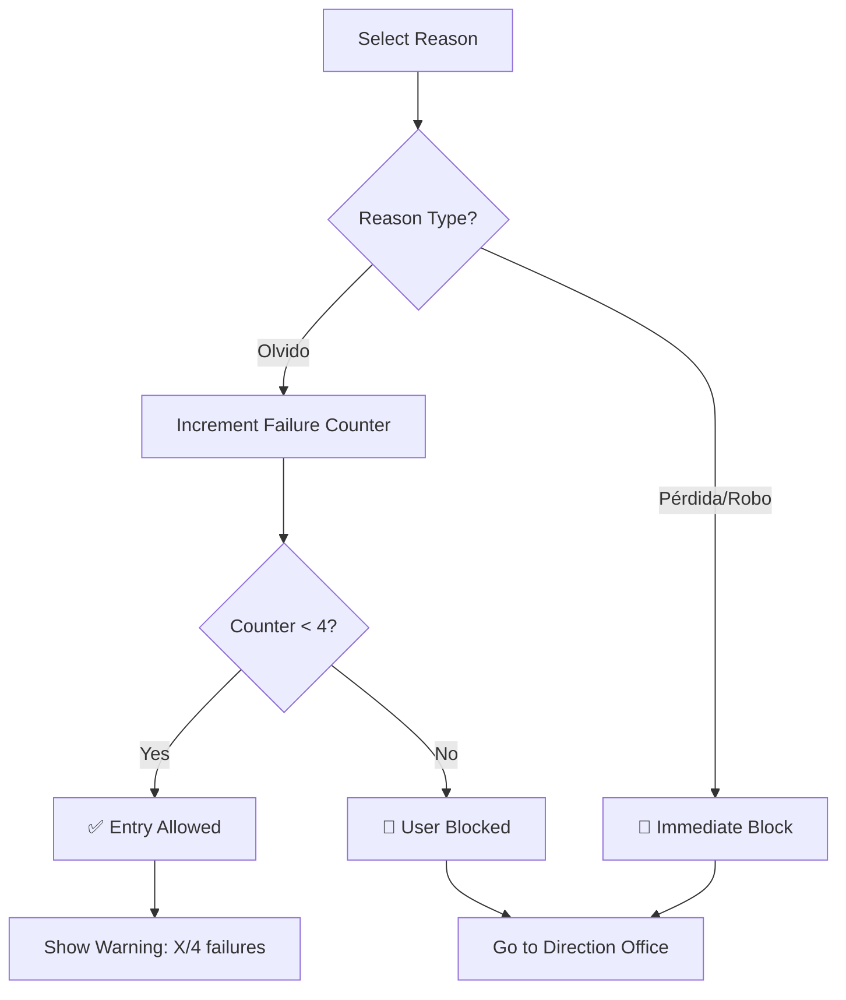

## What is UCC Control de Acceso?

UCC Control de Acceso is a web application (PWA) designed to manage contingent entry for users who **DO NOT carry their physical ID card** at Universidad Cooperativa de Colombia entrances.

<Warning>
  **Important:** This application is **ONLY** used when users **DO NOT have their physical ID card**. It does not record normal entries.
</Warning>

## First Time Access

<Steps>
  <Step title="Navigate to the Login Page">
    Open the application in your web browser. You'll see the UCC logo and a simple login interface.

    {/* Screenshot placeholder: Login page interface */}
  </Step>

  <Step title="Enter Your Institutional ID">
    Type your institutional ID number (e.g., `80123456`) in the input field.

    <Info>
      Your institutional ID is the unique identifier assigned to you by UCC, typically starting with '80' for students.
    </Info>

    ```jsx
    // The login form only accepts numeric input
    <input
      type="text"
      pattern="[0-9]*"
      placeholder="Ejemplo: 80123456"
      className="w-full px-4 py-3 border-2 border-gray-300"
    />
    ```
  </Step>

  <Step title="Click 'INGRESAR'">
    Press the blue "INGRESAR" button to authenticate.

    The system will validate your ID against the database and display your profile information.
  </Step>

  <Step title="View Your Profile">
    After successful login, you'll see:
    - Your full name and personal information
    - Your active roles (Student/Employee/Contractor)
    - Your current failure counter
    - Role-specific information

    ```jsx
    // Example user profile data structure
    {
      id_institucional: "80123456",
      nombre_completo: "Juan Pérez Gómez",
      documento_identidad: "1234567890",
      roles: ["Estudiante", "Empleado"],
      total_fallas: 2,
      estado_general: "activo"
    }
    ```
  </Step>

  <Step title="Report Your ID Card Status">
    Click the green **"Reportar TIC"** button at the bottom of the screen to report why you don't have your card.

    <Note>
      TIC stands for "Tarjeta de Identificación Cooperativista" (Cooperative ID Card).
    </Note>
  </Step>
</Steps>

## Selecting a Failure Reason

When you click "Reportar TIC", a modal will appear with three options:

<CardGroup cols={3}>
  <Card title="Olvido" icon="face-frown">
    **I Forgot It**
    
    You simply forgot to bring your card today.
    
    - Adds +1 to your failure counter
    - Allows up to 3 times
    - Blocks automatically on 4th occurrence
  </Card>

  <Card title="Pérdida" icon="magnifying-glass">
    **I Lost It**
    
    You've lost your ID card and don't know where it is.
    
    - **Immediate block**
    - Does NOT increment counter
    - Must visit Direction office
  </Card>

  <Card title="Robo" icon="shield-exclamation">
    **It Was Stolen**
    
    Your ID card was stolen.
    
    - **Immediate block**
    - Does NOT increment counter
    - Must visit Direction office
  </Card>
</CardGroup>

### Failure Logic Flow



## Understanding the Failure Counter

<Info>
  The failure counter tracks how many times you've reported "Olvido" (forgot) as the reason for not having your card.
</Info>

### Counter Stages

<Tabs>
  <Tab title="1st Time (1/4)">
    **Status:** ✅ Entry Allowed
    
    ```
    First offense - no problem!
    You can still enter the campus.
    ```
    
    <Note>Keep track of your card to avoid accumulating failures.</Note>
  </Tab>

  <Tab title="2nd Time (2/4)">
    **Status:** ✅ Entry Allowed
    
    ```
    Second time - still okay.
    Entry permitted, but be careful.
    ```
    
    <Warning>You're halfway to being blocked. Remember to bring your card!</Warning>
  </Tab>

  <Tab title="3rd Time (3/4)">
    **Status:** ⚠️ Entry Allowed (Risk)
    
    ```
    Third strike - CRITICAL WARNING!
    One more time and you'll be blocked.
    ```
    
    <Warning>
      **DANGER ZONE:** The next "Olvido" report will result in an automatic block.
    </Warning>
  </Tab>

  <Tab title="4th Time (4/4)">
    **Status:** 🚫 BLOCKED
    
    ```
    Fourth offense - AUTOMATIC BLOCK
    Entry denied. Must visit Direction.
    ```
    
    <Warning>
      **BLOCKED:** You must go to the Direction office to request an unblock. Your counter will be reset to 0 after unblock.
    </Warning>
  </Tab>
</Tabs>

### Failure Counter Rules

<CodeGroup>
```javascript JavaScript
// Business logic for "Olvido" (Forgot)
if (motivo === 'olvido') {
  usuario.total_fallas += 1;
  
  if (usuario.total_fallas >= 4) {
    usuario.estado_general = 'bloqueado';
    // Create block record
    await createBlockRecord({
      motivo_bloqueo: 'limite_fallas',
      usuario_id: usuario.id
    });
  }
}
```

```sql SQL
-- Register failure in database
INSERT INTO Registro_Fallas (
  usuario_id,
  motivo,
  fecha_hora,
  sede_registro
) VALUES (
  ?,
  'olvido',
  NOW(),
  'Campus Principal'
);
```
</CodeGroup>

## What Happens After Reporting?

### If You Selected "Olvido" (Forgot)

<Steps>
  <Step title="Counter Increments">
    Your `total_fallas` counter increases by 1.
  </Step>

  <Step title="System Evaluates">
    - **If counter < 4:** ✅ Entry is granted
    - **If counter = 4:** 🚫 You are blocked automatically
  </Step>

  <Step title="You See Feedback">
    A success message appears:
    
    ```jsx
    <div className="bg-green-50 border border-green-300 rounded-2xl p-4">
      ✅ Falla registrada correctamente.
      Fallas acumuladas: {totalFallas}/4
    </div>
    ```
  </Step>

  <Step title="Entry Decision">
    - **Allowed:** Proceed to campus
    - **Blocked:** Visit Direction office with your official ID document
  </Step>
</Steps>

### If You Selected "Pérdida" or "Robo"

<Warning>
  **Immediate Block:** Your account is blocked instantly for security reasons.
</Warning>

<Steps>
  <Step title="Immediate Block">
    Your account status changes to `bloqueado` (blocked) immediately.
  </Step>

  <Step title="No Counter Increment">
    The failure counter does **NOT** increase.
  </Step>

  <Step title="Block Record Created">
    A permanent record is created in `Historial_Bloqueos`:
    
    ```sql
    INSERT INTO Historial_Bloqueos (
      usuario_id,
      fecha_bloqueo,
      motivo_bloqueo,
      estado
    ) VALUES (
      usuario_id,
      NOW(),
      'perdida_carnet', -- or 'robo_carnet'
      'activo'
    );
    ```
  </Step>

  <Step title="Required Action">
    You must:
    1. Go to the Direction office
    2. Report the loss/theft officially
    3. Request a new ID card
    4. Wait for administrator to unblock your account
  </Step>
</Steps>

## User States

<CardGroup cols={2}>
  <Card title="Activo" icon="circle-check" color="#22C55E">
    **Active Status**
    
    - ✅ Can enter campus
    - ✅ Can report failures
    - ✅ Counter < 4
    
    No action required - you're good to go!
  </Card>

  <Card title="Bloqueado" icon="ban" color="#EF4444">
    **Blocked Status**
    
    - ❌ Cannot enter campus
    - ❌ Must visit Direction
    - ❌ Counter = 4 or Loss/Theft reported
    
    **Action Required:** Contact administration for unblock.
  </Card>
</CardGroup>

## Multi-Role Users

Many users have multiple roles at UCC (e.g., Student + Employee). The system displays all your active roles:

```jsx
// Example: User with multiple roles
const user = {
  nombre_completo: "Juan Pérez Gómez",
  roles: ["Estudiante", "Empleado"],
  
  // Student-specific information
  info_estudiante: {
    programa_academico: "Ingeniería de Sistemas",
    facultad: "Facultad de Ingeniería",
    campus_sede: "Bogotá",
    semestre: 8,
    estado_academico: "activo"
  },
  
  // Employee-specific information
  info_empleado: {
    dependencia: "Área Financiera",
    cargo: "Coordinador de Tesorería",
    tipo_contrato: "indefinido"
  }
};
```

<Note>
  The failure counter and block status apply to **all your roles**. If you're blocked as a student, you're also blocked as an employee.
</Note>

## Semester Reset

<Info>
  At the end of each semester, the entire database is cleaned and reloaded with new data.
</Info>

### What Gets Reset:
- ✅ Failure counters → 0
- ✅ User data → Updated from CSV
- ✅ Blocks → Cleared (except administrative)
- ✅ Historical data → Exported to Excel before deletion

## Need Help?

<CardGroup cols={2}>
  <Card title="Blocked Account" icon="lock">
    Visit the Direction office with your official identification document.
  </Card>

  <Card title="Technical Issues" icon="bug">
    Contact IT support at `soporte@ucc.edu.co`
  </Card>

  <Card title="Lost ID Card" icon="id-card">
    Report to campus security immediately and request a new card.
  </Card>

  <Card title="Wrong Information" icon="triangle-exclamation">
    Contact the administration office to update your profile data.
  </Card>
</CardGroup>

## Next Steps

<Card title="Learn About the Architecture" icon="sitemap" href="/architecture">
  Understand how the system works under the hood, including the Clean Architecture implementation and technology stack.
</Card>